# PACS AI Backend

[](https://docs.docker.com/compose/)

A robust PACS identity and user access management API using Firebase with multi-tenancy support.

## Prerequisites

Before running this repository, ensure you have:

- [Docker](https://docs.docker.com/engine/install/) version >= v2.24.7 (check with `docker compose version`)
- [DockerHub](https://hub.docker.com/) account
- [Google Cloud Platform](https://cloud.google.com/) and [Firebase](https://firebase.google.com/) account (only one account is needed, they are linked)
- [Mailgun](https://www.mailgun.com/) account for email services
- Valid SSL certificate from hospital CA (for Nginx)
- Make utility (`sudo apt-get install make` on Ubuntu or `dnf install make` on CentOS/Rocky Linux/RHEL)

## Getting Started

### 1. Project Setup

1. Create and setup project directory:

   ```bash
   # Create project directory and clone repository
   mkdir pacs-ai
   cd pasc-ai
   git clone https://github.com/HeartWise-AI/pacs-ai-backend.git
   git clone https://github.com/HeartWise-AI/PACS-AI.git

   # Setup environment files
   cp PACS-AI/platform/app/.env.example PACS-AI/platform/app/.env
   cp pacs-ai-backend/api-pacs/.env.example pacs-ai-backend/api-pacs/.env
   cp pacs-ai-backend/orthanc/.env.example pacs-ai-backend/orthanc/.env
   cp pacs-ai-backend/nginx/.env.example pacs-ai-backend/nginx/.env
   ```

2. Create Docker network:
   ```bash
   docker network create pacs-net
   ```

### 2. External Services Setup

#### 2.1 Google Cloud Platform Setup

1. Create or sign in to your [Google Cloud Platform](https://cloud.google.com/) account
   > Note: You will need to have a billing account linked to your Google account, but you can use the free tier as everything we are using is free.
2. Navigate to the [Google Cloud Console](https://console.cloud.google.com/)
3. Create new project named `pacs-ai-prod`:
   <p align="center">
     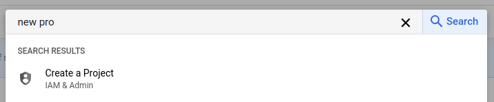
   </p>
   <p align="center">
     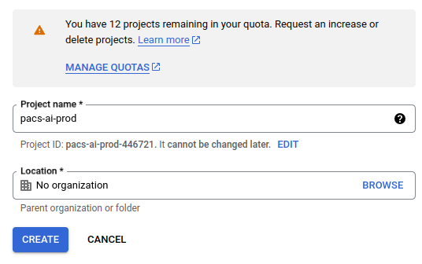
   </p>
4. Enable Identity Platform:
   - In the console search bar, search for `Identity Platform` and enable it
   <p align="center">
     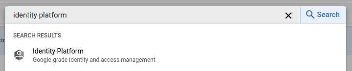
   </p>
5. Configure Identity Platform:
   - Go to Settings → Security → Multi Tenancy and enable it
   - Go to Tenants and create a new tenant named `prod`
     > Note: A tenant ID will be automatically generated - you will need this ID for the Firebase setup
   - Go to Providers, select your tenant in the `Scope to a tenant` box and enable email/password provider:
     <p align="center">
       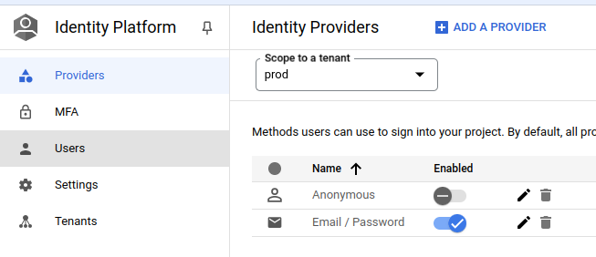
     </p>

#### 2.2 Firebase Setup

1. Sign in to [Firebase Console](https://console.firebase.google.com)
   > Note: Use the same Google account you used for the Google Cloud Platform project
   - You should see a project named `pacs-ai-prod` already created with the same project ID
2. Configure Authentication:
   - Click on the project name to open the project dashboard
   - In the left sidebar, under Build, click on `Authentication`
   - Go to the `Sign-in method` tab and enable the `Email/Password` provider
   <p align="center">
     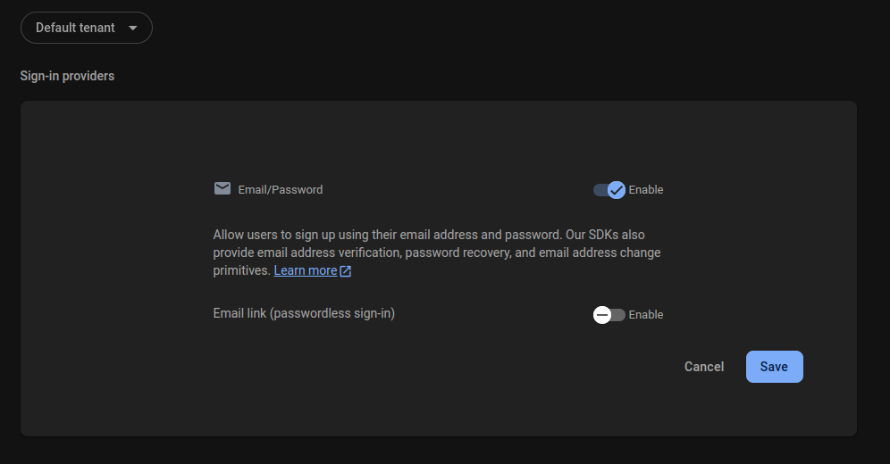
   </p>
3. Setup Firestore Database:

   - In the left sidebar, under Build, click on `Firestore Database`
   - Click on `Create database`
   - Do not change the `Database Id` and set the `Location` to `northamerica-northeast1 (Montréal)`
   <p align="center">
     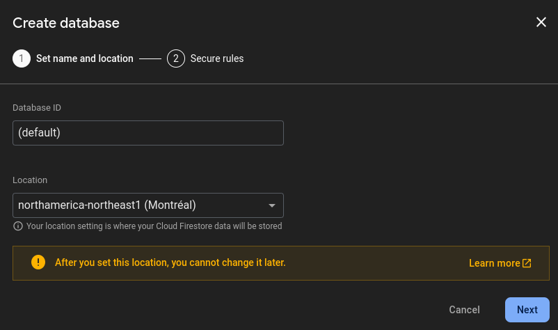
   </p>

   - Select `Start in production mode` and click on `Create`
   <p align="center">
     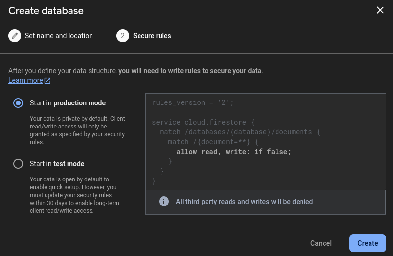
   </p>

   - Create a new collection named `tenants` with the following structure:
   <p align="center">
     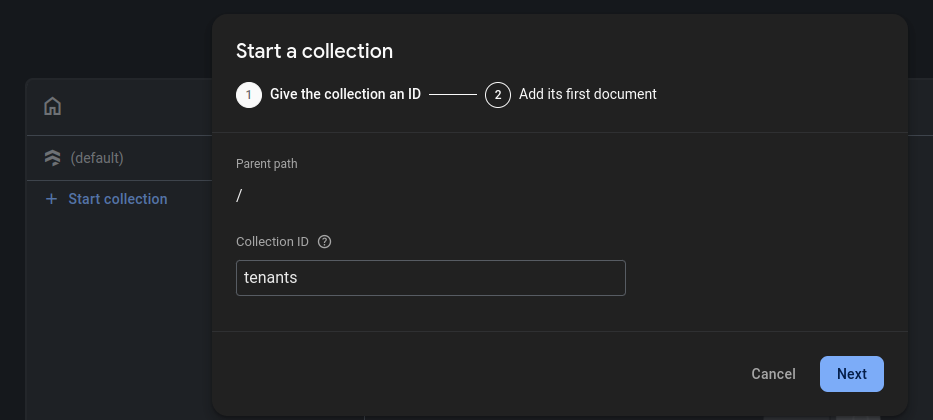
   </p>

   ```
   Document ID: <Tenant_ID>  # This is the ID of the tenant you created in GCP
   Fields:
     - name: "PACS AI DEMO"  # This is a descriptive name for the tenant, it will be displayed in the PACS-AI web app
   ```

4. Configure Web Application:

   - Go to the project settings page
   <p align="center">
     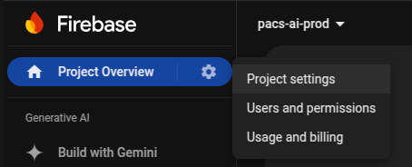
   </p>

   - On the `General` tab, add a web app
   <p align="center">
     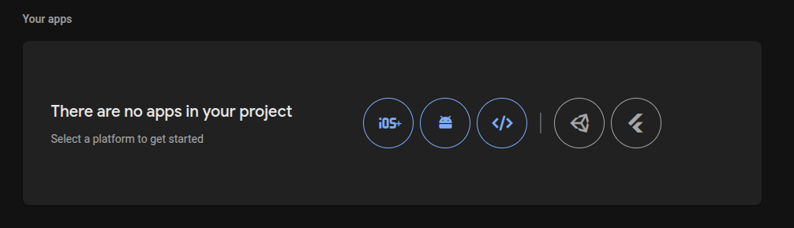
   </p>

   - Name it `pacs-ai-webapp`, register it and continue to console
   <p align="center">
     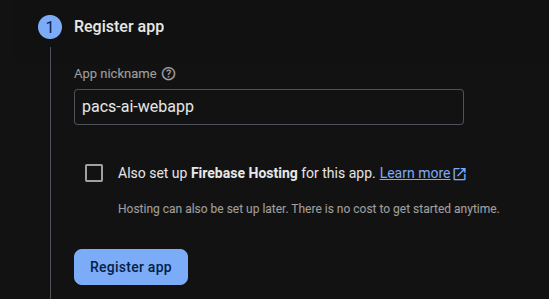
   </p>

   > Note: You will be redirected to the web app dashboard where you can see the `Web SDK configuration` code. Copy these values to `PACS-AI/platform/app/.env`. See the [PACS-AI README](https://github.com/HeartWise-AI/PACS-AI/blob/master/platform/app/README.md) for more details.

5. Setup Service Account:
   - Still on the project settings page, click on `Service accounts` tab
   - Click on `Generate new private key`
   - Rename the downloaded file to `pacs-ai-firebase-admin.json`
   - Save it in `api-pacs/configs/firebase/pacs-ai-firebase-admin.json`
     > Note: This file contains the credentials for the GO API to access the Firebase database

#### 2.3 Mailgun Setup

1. Create a [Mailgun](https://www.mailgun.com/) account
2. Connect your domain to Mailgun
   > Note: This requires domain ownership and DNS configuration knowledge. Contact us if you need assistance with the setup!
3. Once connected, copy the API key to `pacs-ai-backend/nginx/.env`

### 3. Configuration for Production

#### API Configuration

Update `api-pacs/.env` with the following variables:

| Variable                    | Description                                                                         |
| --------------------------- | ----------------------------------------------------------------------------------- |
| `API_NAME`                  | Should be set to `api-pacs` (do not change)                                         |
| `API_URL_REST_PORT`         | Should be set to `8000` (do not change)                                             |
| `APP_URL`                   | Your domain URL (e.g., `https://MyDomain.com`)                                      |
| `DOCKER_USERNAME`           | Your DockerHub username                                                             |
| `DOCKER_PASSWORD`           | Your DockerHub password                                                             |
| `DOCKER_NETWORK`            | Should be set to `pacs-net`                                                         |
| `ELASTICSEARCH_URL`         | Should be set to `http://elasticsearch:9200`                                        |
| `FIREBASE_CONFIG_FILE_PATH` | Should be set to `/app/build/configs/firebase/pacs-ai-firebase-admin.json`          |
| `FIREBASE_PROJECT_ID`       | Your Firebase project ID (same as in `PACS-AI/platform/app/.env`)                   |
| `FIREBASE_SUPERUSER_KEY`    | Strong password for super user access (used for first user creation and API access) |
| `KIBANA_BASE_URL`           | Should be set to `http://kibana:5601`                                               |
| `MAILGUN_API_KEY`           | Your Mailgun API key                                                                |
| `MAILGUN_DOMAIN`            | Your Mailgun domain                                                                 |
| `MAILGUN_SENDER_EMAIL`      | Your sender email (e.g., `no-reply@MyDomain.com`)                                   |
| `OPENAPI_DOCS_PASSWORD`     | Strong password for API documentation access                                        |
| `ORTHANC_AET`               | Should be set to `PACS_AI`                                                          |
| `ORTHANC_BASE_URL`          | Should be set to `http://orthanc:8042` or correct port                              |
| `REDIS_HOST`                | Should be set to `redis`                                                            |
| `REDIS_PORT`                | Should be set to `6379` (do not change)                                             |
| `REDIS_PASSWORD`            | Should be set to `pacs.staging` (requires update in `redis/redis.conf` if changed)  |
| `REDIS_IAM_DB`              | Should be set to `1` (do not change)                                                |

#### DICOM Configuration

Update `pacs-ai-backend/orthanc/.env` with appropriate port and AET settings:

- Consult with PACS admins for proper port configuration if you are unsure
- The AET (Application Entity Title) must be unique in your PACS network

#### Network Configuration

1. Update `pacs-ai-backend/nginx/.env` with your domain:

   ```env
   SERVER_NAME=MyDomain.com  # or IP address
   ```

2. SSL Certificates:
   - Place valid SSL certificates in `pacs-ai-backend/nginx/ssl/`:
     - `nginx.crt`: Your SSL certificate
     - `nginx.key`: Your SSL private key
   - If no valid certificates are provided:
     - Self-signed certificates will be auto-generated
     - These will be invalid and not recognized by browsers
     - Users will need to ignore SSL certificate warnings

## Usage

### Launching the Application in Production

From the `pacs-ai-backend` directory:

```bash
make up-prod # This will start the application in production mode
make down-prod # This will stop the application
```

> Note: Initial startup may take several minutes while containers are being built and initialized. Subsequent restarts will be faster as containers are reused.

### Access Points

| Service           | URL                           |
| ----------------- | ----------------------------- |
| API Documentation | https://MyDomain.com/api/docs |

### 4. Configuration for Development

#### API Configuration

Update `api-pacs/.env` with the following variables:

| Variable                    | Description                                                                                                               |
| --------------------------- | ------------------------------------------------------------------------------------------------------------------------- |
| `API_NAME`                  | Should be set to `api-pacs` (do not change)                                                                               |
| `API_URL_REST_PORT`         | Should be set to `8000` (do not change)                                                                                   |
| `APP_URL`                   | Should be set to `http://localhost:3000`                                                                                  |
| `DOCKER_USERNAME`           | Your DockerHub username                                                                                                   |
| `DOCKER_PASSWORD`           | Your DockerHub password                                                                                                   |
| `DOCKER_NETWORK`            | Should be set to `pacs-net`                                                                                               |
| `ELASTICSEARCH_URL`         | Should be set to `http://localhost:9200`                                                                                  |
| `FIREBASE_CONFIG_FILE_PATH` | Should be set to `pacs-ai-backend/api-pacs/configs/firebase/pacs-ai-firebase-admin.json`, make sure it's the correct path |
| `FIREBASE_PROJECT_ID`       | Your Firebase project ID (same as in `PACS-AI/platform/app/.env`)                                                         |
| `FIREBASE_SUPERUSER_KEY`    | Strong password for super user access (used for first user creation and API access)                                       |
| `KIBANA_BASE_URL`           | Should be set to `http://localhost:5601`                                                                                  |
| `MAILGUN_API_KEY`           | Your Mailgun API key                                                                                                      |
| `MAILGUN_DOMAIN`            | Your Mailgun domain                                                                                                       |
| `MAILGUN_SENDER_EMAIL`      | Your sender email (e.g., `no-reply@MyDomain.com`)                                                                         |
| `OPENAPI_DOCS_PASSWORD`     | Strong password for API documentation access                                                                              |
| `ORTHANC_AET`               | Should be set to `PACS_AI`                                                                                                |
| `ORTHANC_BASE_URL`          | Should be set to `http://orthanc:8042` or correct port                                                                    |
| `REDIS_HOST`                | Should be set to `localhost`                                                                                              |
| `REDIS_PORT`                | Should be set to `6379` (do not change)                                                                                   |
| `REDIS_PASSWORD`            | Should be set to `pacs.staging` (requires update in `redis/redis.conf` if changed)                                        |
| `REDIS_IAM_DB`              | Should be set to `1` (do not change)                                                                                      |

#### DICOM Configuration

No DICOM configuration is needed for local development, PACS-AI will use emulated DICOM services.

#### Network Configuration

No network configuration is needed for local development

## Usage

### Launching the Application in Production

From the `pacs-ai-backend` directory:

```bash
make up # This will start the application in local mode
make down # This will stop the application
```

## Support

Maintained with ❤️ by [Nuxify](https://nuxify.tech) and [HeartWise AI](https://heartwise.ai)
