# PACS-AI Backend — Architecture

High-level map of the services that make up the PACS-AI backend and how they interact. Companion to the [deployment guide](./deployment-guide.md), the [ingestion architecture plan](./ingestion-architecture-plan.md), and the [cardio-agent integration plan](./cardio-agent-integration-plan.md).

---

## Service inventory

| Service | Folder | Type | Entry point |
|---|---|---|---|
| **api-pacs** | [api-pacs/](../api-pacs/) | Go REST API + workers (Chi, DDD) | [api-pacs/cmd/main.go](../api-pacs/cmd/main.go) |
| **orthanc** | [orthanc/](../orthanc/) | DICOM server (C-STORE / C-MOVE / REST) | image `orthancteam/orthanc` |
| **orthanc-pacs** | [orthanc-pacs/](../orthanc-pacs/) | Simulated remote PACS (dev only, opt-in) | compose only |
| **cardio-agent / study-service** | [cardio-agent/study-service/](../cardio-agent/study-service/) | FastAPI + Celery worker — model execution | study-service `main.py` + Celery |
| **cardio-agent / backend** | [cardio-agent/backend/](../cardio-agent/backend/) | LangGraph agent framework (interactive) | backend app |
| **orchestrator** | [orchestrator/](../orchestrator/) | FastAPI + LangGraph LLM orchestrator (standby) | [orchestrator/main.py](../orchestrator/main.py) |
| **nginx** | [nginx/](../nginx/) | Reverse proxy / TLS termination | conf only |
| **postgresql** | [postgresql/](../postgresql/) | Control-plane DB (port 5433) | image |
| **cardio postgres** | root [docker-compose.yml](../docker-compose.yml) | cardio-agent DB (port 5434) | image |
| **redis** | [redis/](../redis/) | Celery broker + cache | image |
| **elasticsearch** | [elasticsearch/](../elasticsearch/) | Study/log indexing | image |
| **ollama** | [ollama/](../ollama/) | Local LLM runtime (optional, GPU) | image |
| **model-template / model-examples** | [model-template/](../model-template/), [model-examples/](../model-examples/) | Inference container scaffolds | per-model Dockerfiles |

> [cardio-agent-backup/](../cardio-agent-backup/) is a stale snapshot — ignore.

The root [docker-compose.yml](../docker-compose.yml) wires these together via `include:`. All containers share the external Docker network **`pacs-net`**.

---

## api-pacs internal layout (DDD)

Each module under [api-pacs/module/](../api-pacs/module/) follows `domain / application / infrastructure / interface` layers:

- [module/inference/](../api-pacs/module/inference/) — core ingestion engine (jobs, candidate discovery, retrieval, dispatch). Includes [InferenceCommandService.go](../api-pacs/module/inference/infrastructure/service/InferenceCommandService.go) and `StudyServiceDispatcher`.
- [module/orthanc/](../api-pacs/module/orthanc/) — Orthanc HTTP + DIMSE client (C-FIND / C-MOVE).
- [module/elasticsearch/](../api-pacs/module/elasticsearch/) — study indexing/search.
- [module/iam/](../api-pacs/module/iam/) — Firebase auth.
- [module/tenant/](../api-pacs/module/tenant/), [module/user/](../api-pacs/module/user/) — multi-tenancy & users.
- [module/lead/](../api-pacs/module/lead/) — domain (cardio leads).
- [module/orchestrator/](../api-pacs/module/orchestrator/) — thin shim to the orchestrator service.

Entry points:
- HTTP server: [api-pacs/cmd/main.go](../api-pacs/cmd/main.go) → REST router under [api-pacs/interfaces/](../api-pacs/interfaces/).
- Background workers: [api-pacs/interfaces/cron.go](../api-pacs/interfaces/cron.go) — three loops:
  1. **Ingestion runner** — C-FIND remote PACS, populates `inference_ingestion_candidates`, computes stability.
  2. **Retrieval worker** — C-MOVE stable candidates into local Orthanc, then POSTs to study-service.
  3. **Reconciliation worker** — reconciles stale processing jobs.

---

## Inter-service flow (primary ingestion)

1. **Discovery** — api-pacs ingestion runner C-FINDs the remote PACS, records candidates as `DISCOVERED`, marks them `STABLE` once series/instance counts settle.
2. **Retrieval** — api-pacs retrieval worker C-MOVEs `STABLE` candidates into local Orthanc, then `POST /ingest/study` to study-service.
3. **Processing** — study-service creates a `pipeline_jobs` row and enqueues a Celery task; the worker fetches frames from Orthanc, calls the appropriate model container, and stores results in `pipeline_results`.
4. **Reconciliation** — api-pacs reconciliation worker syncs status against study-service for stale jobs.
5. **Cleanup** — Phase-4 of [ingestion-architecture-plan.md](./ingestion-architecture-plan.md), in progress.

See [ingestion-architecture-plan.md](./ingestion-architecture-plan.md) for the full 13-state candidate state machine.

---

## Mermaid diagram

Renders natively on GitHub/GitLab and in VS Code with the Mermaid preview extension. Live editor: https://mermaid.live.

```mermaid
flowchart TB
    %% ===== External =====
    subgraph EXT["External"]
        RemotePACS["Remote PACS<br/>(hospital DICOM source)"]
        WebUI["Web UI / Clients"]
    end

    %% ===== Edge =====
    subgraph EDGE["Edge"]
        Nginx["nginx<br/>(TLS, reverse proxy)<br/>:80 / :443"]
    end

    %% ===== Control Plane =====
    subgraph CTRL["Control Plane — api-pacs (Go, Chi, DDD)"]
        APIPacsHTTP["REST API<br/>cmd/main.go<br/>:8000"]
        subgraph CRONS["Background workers (interfaces/cron.go)"]
            Discovery["Ingestion runner<br/>(C-FIND, stability)"]
            Retrieval["Retrieval worker<br/>(C-MOVE → Orthanc)"]
            Reconcile["Reconciliation worker<br/>(stale processing)"]
        end
        subgraph MODULES["module/* (DDD layers)"]
            ModInference["inference"]
            ModOrthanc["orthanc"]
            ModES["elasticsearch"]
            ModIAM["iam (Firebase)"]
            ModTenant["tenant / user"]
            ModLead["lead"]
        end
    end

    %% ===== DICOM Plane =====
    subgraph DICOM["DICOM Plane"]
        Orthanc["Orthanc<br/>DICOM store + REST<br/>:8042"]
        OrthancIdx["Orthanc index<br/>(internal Postgres)"]
        OrthancPACS["orthanc-pacs<br/>(simulated remote, dev only)"]
    end

    %% ===== Execution Plane =====
    subgraph EXEC["Execution Plane — cardio-agent"]
        StudySvc["study-service<br/>FastAPI<br/>:8600"]
        CeleryWorker["Celery worker<br/>(process_study)"]
        subgraph MODELS["Model containers"]
            ModelTpl["model-template /<br/>model-examples<br/>(per-modality inference)"]
        end
        AgentBackend["cardio-agent backend<br/>(LangGraph, interactive)"]
    end

    %% ===== Optional / standby =====
    subgraph OPT["Optional"]
        Orchestrator["orchestrator<br/>FastAPI + LangGraph<br/>:8585"]
        Ollama["ollama<br/>(local LLM, GPU)<br/>:11434"]
    end

    %% ===== Data stores =====
    subgraph DATA["Data Stores"]
        PgCtrl[("PostgreSQL :5433<br/>ingestion_jobs<br/>ingestion_candidates<br/>processing_jobs")]
        Firestore[("Firebase Auth + Firestore<br/>tenants, users,<br/>email invites, metadata")]
        PgAgent[("PostgreSQL :5434<br/>pipeline_jobs<br/>pipeline_results")]
        Redis[("Redis :6379<br/>Celery broker + cache")]
        ES[("Elasticsearch :9200<br/>studies + activity")]
    end

    %% ===== Flows =====
    WebUI -->|HTTPS| Nginx
    Nginx -->|/api/*| APIPacsHTTP
    Nginx -->|/orthanc/*| Orthanc

    Discovery -->|C-FIND| RemotePACS
    Retrieval -->|C-MOVE| RemotePACS
    RemotePACS -.->|DICOM transfer| Orthanc
    Retrieval -->|REST poll| Orthanc

    APIPacsHTTP -.uses.-> MODULES
    CRONS -.uses.-> MODULES

    Retrieval -->|POST /ingest/study| StudySvc
    Reconcile -->|status sync| StudySvc

    StudySvc -->|enqueue| Redis
    Redis -->|dequeue| CeleryWorker
    CeleryWorker -->|fetch frames REST| Orthanc
    CeleryWorker -->|HTTP / gRPC| ModelTpl
    ModelTpl -.optional.-> Orthanc

    Orthanc --- OrthancIdx
    OrthancPACS -.dev only.-> RemotePACS

    %% Data store wiring
    APIPacsHTTP --- PgCtrl
    CRONS --- PgCtrl
    APIPacsHTTP --- ES
    StudySvc --- PgAgent
    CeleryWorker --- PgAgent
    AgentBackend --- PgAgent

    %% Optional services
    APIPacsHTTP -.->|optional| Orchestrator
    Orchestrator -.-> Ollama
    AgentBackend -.-> Ollama

    %% IAM data
    ModIAM --- Firestore
    ModTenant --- Firestore

    %% Auth
    ModIAM -.verifies.-> WebUI

    %% ===== Styling =====
    classDef ext fill:#fde2e4,stroke:#c1121f,color:#000
    classDef edge fill:#fff3b0,stroke:#b08900,color:#000
    classDef ctrl fill:#cfe1f2,stroke:#1d4e89,color:#000
    classDef dicom fill:#d8f3dc,stroke:#2d6a4f,color:#000
    classDef exec fill:#e0c3fc,stroke:#5a189a,color:#000
    classDef data fill:#eaeaea,stroke:#444,color:#000
    classDef opt fill:#f1faee,stroke:#777,color:#000,stroke-dasharray: 4 3

    class RemotePACS,WebUI ext
    class Nginx edge
    class APIPacsHTTP,Discovery,Retrieval,Reconcile,ModInference,ModOrthanc,ModES,ModIAM,ModTenant,ModLead ctrl
    class Orthanc,OrthancIdx,OrthancPACS dicom
    class StudySvc,CeleryWorker,ModelTpl,AgentBackend exec
    class PgCtrl,PgAgent,Redis,ES,Firestore data
    class Orchestrator,Ollama opt
```



---

## Graphviz / DOT diagram

Same content as above, in DOT for higher-fidelity rendering. Generate SVG/PNG with:

```bash
dot -Tsvg docs/architecture.dot -o docs/architecture.svg
dot -Tpng docs/architecture.dot -o docs/architecture.png
```

Or paste the source below into https://dreampuf.github.io/GraphvizOnline / https://edotor.net.

```dot
digraph pacs_ai_backend {
    rankdir=TB;
    compound=true;
    fontname="Helvetica";
    node [fontname="Helvetica", shape=box, style="rounded,filled", fontsize=11];
    edge [fontname="Helvetica", fontsize=9];
    graph [fontname="Helvetica", style="rounded,filled", fontsize=12];

    // ========== External ==========
    subgraph cluster_ext {
        label="External";
        style="rounded,filled";
        fillcolor="#fde2e4";
        color="#c1121f";
        RemotePACS [label="Remote PACS\n(hospital DICOM source)", fillcolor="#fff"];
        WebUI     [label="Web UI / Clients", fillcolor="#fff"];
    }

    // ========== Edge ==========
    subgraph cluster_edge {
        label="Edge";
        style="rounded,filled";
        fillcolor="#fff3b0";
        color="#b08900";
        Nginx [label="nginx\nTLS, reverse proxy\n:80 / :443", fillcolor="#fff"];
    }

    // ========== Control plane ==========
    subgraph cluster_ctrl {
        label="Control Plane — api-pacs (Go, Chi, DDD)";
        style="rounded,filled";
        fillcolor="#cfe1f2";
        color="#1d4e89";

        APIPacsHTTP [label="REST API\ncmd/main.go\n:8000", fillcolor="#fff"];

        subgraph cluster_crons {
            label="Background workers\ninterfaces/cron.go";
            style="rounded,filled";
            fillcolor="#e6f0fa";
            color="#1d4e89";
            Discovery [label="Ingestion runner\n(C-FIND, stability)", fillcolor="#fff"];
            Retrieval [label="Retrieval worker\n(C-MOVE → Orthanc)", fillcolor="#fff"];
            Reconcile [label="Reconciliation worker\n(stale processing)", fillcolor="#fff"];
        }

        subgraph cluster_modules {
            label="module/* (DDD layers)";
            style="rounded,filled";
            fillcolor="#e6f0fa";
            color="#1d4e89";
            ModInference [label="inference",  fillcolor="#fff"];
            ModOrthanc   [label="orthanc",    fillcolor="#fff"];
            ModES        [label="elasticsearch", fillcolor="#fff"];
            ModIAM       [label="iam (Firebase)", fillcolor="#fff"];
            ModTenant    [label="tenant / user",  fillcolor="#fff"];
            ModLead      [label="lead",       fillcolor="#fff"];
        }
    }

    // ========== DICOM plane ==========
    subgraph cluster_dicom {
        label="DICOM Plane";
        style="rounded,filled";
        fillcolor="#d8f3dc";
        color="#2d6a4f";
        Orthanc      [label="Orthanc\nDICOM store + REST\n:8042", fillcolor="#fff"];
        OrthancIdx   [label="Orthanc index\n(internal Postgres)", fillcolor="#fff"];
        OrthancPACS  [label="orthanc-pacs\n(simulated remote, dev)", fillcolor="#fff", style="rounded,filled,dashed"];
    }

    // ========== Execution plane ==========
    subgraph cluster_exec {
        label="Execution Plane — cardio-agent";
        style="rounded,filled";
        fillcolor="#e0c3fc";
        color="#5a189a";
        StudySvc      [label="study-service\nFastAPI\n:8600", fillcolor="#fff"];
        CeleryWorker  [label="Celery worker\n(process_study)", fillcolor="#fff"];
        ModelTpl      [label="Model containers\nmodel-template /\nmodel-examples", fillcolor="#fff"];
        AgentBackend  [label="cardio-agent backend\nLangGraph (interactive)", fillcolor="#fff", style="rounded,filled,dashed"];
    }

    // ========== Optional / standby ==========
    subgraph cluster_opt {
        label="Optional / Standby";
        style="rounded,filled,dashed";
        fillcolor="#f1faee";
        color="#777";
        Orchestrator [label="orchestrator\nFastAPI + LangGraph\n:8585", fillcolor="#fff"];
        Ollama       [label="ollama\nlocal LLM (GPU)\n:11434", fillcolor="#fff"];
    }

    // ========== Data stores ==========
    subgraph cluster_data {
        label="Data Stores";
        style="rounded,filled";
        fillcolor="#eaeaea";
        color="#444";
        node [shape=cylinder, style="filled", fillcolor="#fff"];
        PgCtrl    [label="PostgreSQL :5433\ningestion_jobs\ningestion_candidates\nprocessing_jobs"];
        PgAgent   [label="PostgreSQL :5434\npipeline_jobs\npipeline_results"];
        Redis     [label="Redis :6379\nCelery broker + cache"];
        ES        [label="Elasticsearch :9200\nstudies + activity"];
        Firestore [label="Firebase Auth + Firestore\ntenants / users\nemail invites / metadata"];
    }

    // ========== Edges ==========

    // Ingress
    WebUI       -> Nginx        [label="HTTPS"];
    Nginx       -> APIPacsHTTP  [label="/api/*"];
    Nginx       -> Orthanc      [label="/orthanc/*"];

    // Discovery + retrieval
    Discovery   -> RemotePACS   [label="C-FIND"];
    Retrieval   -> RemotePACS   [label="C-MOVE"];
    RemotePACS  -> Orthanc      [label="DICOM transfer", style=dashed];
    Retrieval   -> Orthanc      [label="REST poll"];

    // Modules used by REST + crons (logical, not runtime)
    APIPacsHTTP -> ModInference [style=dotted, arrowhead=none];
    Discovery   -> ModInference [style=dotted, arrowhead=none];
    Retrieval   -> ModOrthanc   [style=dotted, arrowhead=none];
    Reconcile   -> ModInference [style=dotted, arrowhead=none];
    APIPacsHTTP -> ModIAM       [style=dotted, arrowhead=none];
    APIPacsHTTP -> ModTenant    [style=dotted, arrowhead=none];
    APIPacsHTTP -> ModES        [style=dotted, arrowhead=none];
    APIPacsHTTP -> ModLead      [style=dotted, arrowhead=none];

    // Handoff to execution plane
    Retrieval   -> StudySvc     [label="POST /ingest/study"];
    Reconcile   -> StudySvc     [label="status sync"];

    // Execution wiring
    StudySvc      -> Redis        [label="enqueue"];
    Redis         -> CeleryWorker [label="dequeue"];
    CeleryWorker  -> Orthanc      [label="fetch frames (REST)"];
    CeleryWorker  -> ModelTpl     [label="HTTP / gRPC"];
    ModelTpl      -> Orthanc      [label="optional", style=dashed];

    // Orthanc internals
    Orthanc      -> OrthancIdx;
    OrthancPACS  -> RemotePACS    [label="dev only", style=dashed];

    // Data store wiring
    APIPacsHTTP  -> PgCtrl  [arrowhead=none];
    Discovery    -> PgCtrl  [arrowhead=none];
    Retrieval    -> PgCtrl  [arrowhead=none];
    Reconcile    -> PgCtrl  [arrowhead=none];
    APIPacsHTTP  -> ES      [arrowhead=none];
    StudySvc     -> PgAgent [arrowhead=none];
    CeleryWorker -> PgAgent [arrowhead=none];
    AgentBackend -> PgAgent [arrowhead=none, style=dashed];

    // IAM storage
    ModIAM     -> Firestore [arrowhead=none];
    ModTenant  -> Firestore [arrowhead=none];

    // Auth
    ModIAM       -> WebUI       [label="verifies", style=dashed, dir=back];

    // Optional services
    APIPacsHTTP  -> Orchestrator [label="optional", style=dashed];
    Orchestrator -> Ollama       [style=dashed];
    AgentBackend -> Ollama       [style=dashed];
}
```



### Diagram conventions
- **Solid arrow** — active runtime call.
- **Dashed arrow** — optional / dev-only / asynchronous transfer.
- **Dotted arrow (no head)** — "uses" relationship within the same process (REST/cron → DDD module).
- **Cylinders** — data stores.
- **Dashed boxes** — services not in the default `include:` boot path.
