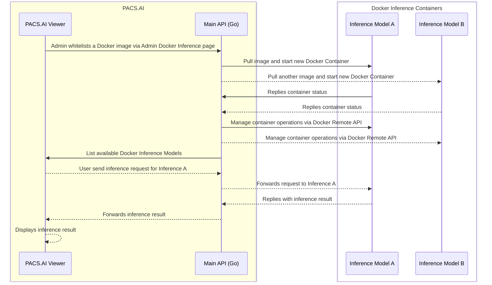

# PACS.AI Inference Model Template

## Sequence Diagram



## OpenAPI Specification

The API interface is defined in `docs/openapi.json`, an OpenAPI specification file and should be implemented by the Inference Model. It serves 3 endpoints:

- `POST /inference/predict`: Perform inference
- `GET /inference/model-info`: Get model information
- `GET /inference/model-facts`: Get model facts

User should populate the `data` directory with model info and facts.

After starting the Docker container, user should be able to interact with the Inference API docs at `http://<host>/docs`.

The endpoints are also documented for the payloads and responses they accept and return, as well as examples.

### POST /inference/predict
```bash
Request:
curl --request POST \
  --url http://localhost:8000/inference/predict \
  --header 'Accept: application/json' \
  --header 'Content-Type: application/json' \
  --data '{
  "inferences": [
    [
      [
        [
          [1, 2, 3],
          [4, 5, 6],
          [7, 8, 9]
        ],
        [
          [10, 11, 12],
          [13, 14, 15],
          [16, 17, 18]
        ]
      ],
      [
        [
          [19, 20, 21],
          [22, 23, 24],
          [25, 26, 27]
        ],
        [
          [28, 29, 30],
          [31, 32, 33],
          [34, 35, 36]
        ]
      ]
    ]
  ],
  "age": 100,
  "gender": "MALE",
  "outputMode": "OHIF_ANNOTATIONS"
}'
```

```bash
Response:
{
  "success": true,
  "message": "Prediction successful",
  "data": {
    "boundingBoxes": [],
    "measurements": [],
    "metadata": {
      "key": "value pair"
    },
    "segmentations": []
  }
}
```

### GET /inference/model-info
```bash
Request:
curl --request GET \
  --url http://localhost:8000/inference/model-info \
  --header 'Accept: application/json'
```

```bash
Response:
{
  "success": true,
  "message": "Operation successful",
  "data": [
    {
      "modelName": "cathef",
      "version": "0.8.0",
      "dicomTargetLevel": "SERIES",
      "dicomUploadMin": 1,
      "dicomUploadMax": 5,
      "supportedDicomModalities": [
        "XA"
      ],
      "supportedOutputModes": [
        "JSON"
      ]
    }
  ]
}
```

### GET /inference/model-facts
```bash
curl --request GET \
  --url http://localhost:8000/inference/model-facts \
  --header 'Accept: application/json'
```

```bash
Response:
{
  "success": true,
  "message": "Model facts retrieved successfully",
  "data": {
    "en": {
      "Changelogs": {
        "1.0.0": "2023-03-01: Initial release"
      },
      "Mechanism": {
        "Input_data_source": "Left coronary angiogram videos",
        "Input_data_type": "Video data",
        "Model_type": "X3D architecture",
        "Outcome": "Prediction of LVEF from left coronary angiograms",
        "Output": "Continuous LVEF percentage value",
        "Target_population": "Adult patients aged ≥18 years who received a coronary angiogram and transthoracic echocardiogram (TTE)",
        "Time_of_prediction": "N/A",
        "Training_data_location_and_time-period": "University of California, San Francisco (UCSF), Dec 12, 2012, to Dec 31, 2019"
      },
      "Other_information": {
        "Clinical_impact_evaluation": "N/A",
        "Clinical_trial": "LVEF Prediction During ACS Using AI Algorithm Applied on Coronary Angiogram Videos (CathEF) - NCT05317286",
        "Clinical_trial_URL": "https://www.clinicaltrials.gov/ct2/show/NCT05317286",
        "Contact_info": "robert.avram.md@gmail.com",
        "Github": "N/A",
        "Outcome_definition": "LVEF",
        "Related_model": "CathAI",
        "Scientific_publication": "N/A"
      },
      "Other_results": {
        "GradCAM": "GradCAM consistently highlighted epicardial LCA vessel segments and septal perforators predominantly during systole as the strongest predictors of low-LVEF."
      },
      "Summary": {
        "Approval_date": "2023-04-17",
        "Description": "CathEF is a video-based deep neural network (DNN) designed to predict left ventricular ejection fraction (LVEF) from left coronary angiograms.",
        "Developed_by": "Dr. Avram, Dr. Tison and Dr. Olgin",
        "Development_period": "2020-01-01 to 2023-04-17",
        "Last_update": "2023-04-17",
        "License_date": "2023-03-01",
        "Licensed_to": "Montreal Heart Institute",
        "Name": "CathEF",
        "Version": "1.0"
      },
      "Uses_and_directions": {
        "Appropriate_decision_and_support": "N/A",
        "Before_using_this_model": "Make sure you have at least three views available to input into the model (RAO Caudal, AP Cranial and LAO Cranial are the best)",
        "Benefits": "Estimation of LVEF from standard LCA angiogram videos without additional",
        "General_use": "CathEF is an automated estimation of LVEF from standard coronary angiogram videos. It can be used to provide real-time, dynamic assessment of cardiac function during coronary angiography without additional equipment or procedures. It is especially useful for patients with acute coronary syndrome or those at increased risk of contrast-induced nephropathy.",
        "Safety_and_efficacy_evaluation": "N/A",
        "Target_population_and_use_case": "Adult patients aged ≥18 years who received a coronary angiogram of the left coronmary angiography."
      },
      "Validation_and_performance": [
        {
          "UCSF_test_dataset": {
            "AUC_ROC_LVEF_40": 0.911,
            "AUC_ROC_LVEF_50": 0.879,
            "ICC_continuous_LVEF": 0.77,
            "MAE_continuous_LVEF": 8.5,
            "Pearson_correlation_continuous_LVEF": 0.71,
            "Sensitivity_LVEF_40": 83.9,
            "Specificity_LVEF_40": 81.3
          },
          "UOHI_external_validation": {
            "AUC_ROC_LVEF_40": 0.906,
            "AUC_ROC_LVEF_50": "N/A",
            "ICC_continuous_LVEF": 0.62,
            "MAE_continuous_LVEF": 7,
            "Pearson_correlation_continuous_LVEF": 0.72,
            "Sensitivity_LVEF_40": 77.9,
            "Specificity_LVEF_40": 88.6
          }
        },
        {
          "UCSF_study_cohort": {
            "Female_percentage": 35,
            "LVEF_over_40_percentage": 82.2,
            "LVEF_under_40_percentage": 17.7,
            "Mean_age": "64.3±13.3",
            "Number_of_angiograms": 3960,
            "Number_of_patients": 3404
          },
          "UOHI_external_validation_cohort": {
            "Female_percentage": 33,
            "LVEF_over_40_percentage": 76.3,
            "LVEF_under_40_percentage": 16.8,
            "Mean_age": "68.6±13.3",
            "Number_of_angiograms": 776,
            "Number_of_patients": 744
          }
        }
      ],
      "Warnings_and_limitations": {
        "Clinical_rationale": "CathEF has not been validated for use with right coronary angiograms.",
        "Discontinue_use_if": "N/A",
        "Generalizability": "The model's generalizability to other healthcare institutions and populations requires further validation.",
        "Inappropriate_decision_support": "CathEF performance may be affected by administration of contrast during angiography, which can temporarily depress LVEF.",
        "Inappropriate_settings": "The model has not been tested on patients with atrial fibrillation, congenital heart disease, or prior cardiac surgery.",
        "Risks": "CathEF's performance may be less accurate at extreme LVEF values."
      }
    }
  }
}
```

The model version should be defined in the `data/model_info.json` and `data/model_facts.json` files. Both data are served by the API with the former used for the viewer display and the latter used to show the model facts following a common convention for AI models.

And of course, the Docker image tag should match the model version during releases. 

## Access and Ports

Inference Model exposes port `80` served by a reverse proxy (Nginx for this example). See `nginx` directory for the configuration.

By default, the `/api` path prefix is reserved for the API service served in port `8000`.

When serving a web app (during a WEBAPP output mode), the `/app` path prefix can be configured and used (recommended port range to use: `7000` to `7999`).

> Important: When launching this Docker container, it must be connected to the same network as the PACS.AI API service.

## Output Modes

The Inference Model supports the following output modes:

- `JSON`: Return a JSON object that can be used to display the result in a PACS.AI Viewer web.
- `OHIF_ANNOTATIONS`: Return a JSON object that can be used to display annotations on the PACS.AI OHIF viewer.
- `HTML`: Return an HTML page that can be used to display the result.
- `WEB_APP`: Return a web app that can be used to display the result.
- `PDF`: Return a PDF file that can be used to display the result.

The client can know the supported output modes from the `supportedOutputModes` field in the `GET /model-info` endpoint response.
